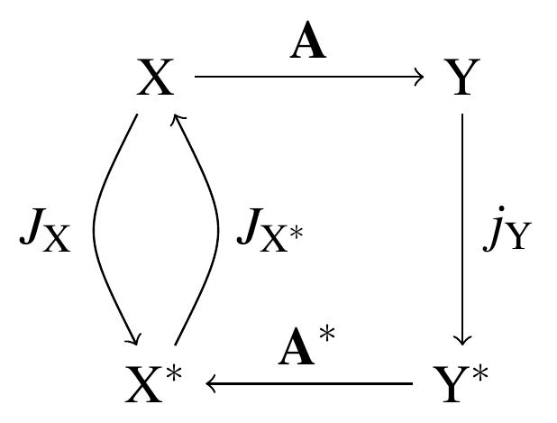

BAnach Sequential Subspace Optimizer
====================================
// Web page meta data
:Author:        Frederik Heber
:Email:         frederik.heber@gmail.com
:keywords:      BASSO, Banach space, minimization, linear system of equations
:description:   BASSO is a library written in C++ for solving underdetermined or overdetermined linear systems of equations Ax=y.
:Date:          {revdate}
:Revision:      {revnumber}
:toc:
:toc-placement: preamble
:doctype:       book
:numbered:

.{revdate}: BASSO {revnumber}
******************************************************************************
BASSO is a C++-library solving overdetermined or underdetermined linear systems of equations in general Banach spaces. Its interface mimicks the same concepts in terms of classes and functions that are also needed for the mathematical proof of convergence, namely spaces, norms, vectors, and (duality) mappings. In other words, vectors are uniquely associated to a specific space instance and calculating a scalar product of vectors from different spaces will fail. This allowed a very robust method of implementing the sequential subspace optimization methods that can be considered a generalization of the the Conjugate Gradient Minimal Error method from Hilbert spaces to Banach spaces. Overall, this provides a very efficient library to solve linear systems of equations with general l_p regularization. Moreover, it also allows to calculate low-rank matrix factorizations.

BASSO received funding from the German Ministry for Research and Education (BMBF) through the project HYPERMATH.

'Frederik Heber'
******************************************************************************

Introduction
------------

One of the most ubiquitous tasks in computing is solving linear systems of equations, where a matrix latexmath:[A] and a right-hand side vector latexmath:[y] are given and we are looking for the solution vector latexmath:[x]. 
Because of the omnipresence of this problem, many different solution methods exist, whose applicability depends on the properties of the matrix: E.g., when the matrix is symmetric, one might use Cholesky factorization. If the matrix is symmetric and positive definite and especially if it is very large, Conjugate Gradient schemes are typically employed.

If the matrix is however more generic, e.g., it is not symmetric, then more general schemes are necessary. Then, we do not have a single space, latexmath:[{\cal X}], but two spaces, latexmath:[{\cal X}] and latexmath:[{\cal Y}]. The solution lives in the former space, the right-hand side in the latter space and the matrix maps in between. 

The system of equation is then typically underdetermined or overdetermined and the solution latexmath:[x] is no longer unique. Therefore, an additional criterion is needed that picks the most sensible solution among the admissible ones. This is called regularization.

Typically, (Tikhonov-)regularization is formulated as a minimization problem by adding a penalty term as follows: 

[latexmath]
+++++++++++
min_x ( || Ax-y ||^2 + \lambda ||x||^2)
+++++++++++

This minimization problems contains two terms: the first is called the data fidelity term that minimizes the residual, i.e. the metric distance to the sets of admissible solutions. The second term is the regularization term that enforces a minimum-norm solution.

Depending on the employed norms in this minimization problem the solutions no longer live in a Hilbert space but in a more general Banach space, e.g., the N-dimensional vector space latexmath:[\mathrm{R}^N] equipped with the norm latexmath:[\ell_{1.1}] norm.  Convergence theoretical results are well-established for Hilbert spaces. For Banach spaces the situation is more difficult:
In a Banach space the space and its dual do not in general coincide, namely they are not in general isometric isomorphic to each other.

This in turn causes us to deal not with two spaces, latexmath:[{\cal X}] and latexmath:[{\cal Y}], but with possibly up to four spaces, latexmath:[{\cal X}], latexmath:[{\cal X}^\ast], latexmath:[{\cal Y}], and latexmath:[{\cal Y}^\ast].

What is the relation between those spaces? Let us give a figure of the mappings.

The matrix latexmath:[A] and its dual mapping latexmath:[A^\ast], which in finite dimensions is simply the complex conjugate, are obvious. However, what are latexmath:[J_p] and so forth?

The residual latexmath:[Ax-y] gives us the natural direction of error as the only information we have about the true solution latexmath:[x] is given in the mapped form as the right-hand side latexmath:[y]. Therefore, we need a mapping that preserves angles and lengths with respect to the norm of the respective space. This role is fulfilled by the so-called duality mappings

[latexmath]
+++++++++++
J_p = { x^\ast \in {\cal X}^\ast | <x^\ast, x> = ||x||^p_{\cal X}, ||x^\ast|| = ||x||^{p-1} },
+++++++++++

where p is associated with the gauge function latexmath:[t \rightarrow t^{p-1}].footnote:[In lp-spaces these two p coincide.]

These are connected to the (sub-)gradient of the norm through the famous theorem of Asplund, latexmath:[J_p(x) = \frac{\partial}{\partial x} ( \tfrac 1 p ||x||^p)]

A sub-gradient is a generalization of the gradient where the space is no longer smooth and therefore the gradient is no longer unique.

As one last ingredient we need a new distance measure, replacing the metric distance that has failed so far in allowing a proof of convergence. We use the Bregman distance,

[latexmath]
+++++++++++
\Delta(x,y) = \tfrac 1 {p^\ast} ||x||^p - < J_p (x), y > + \tfrac 1 p || y ||^p
+++++++++++

All of this can be found in the following nice-to-read academical papers: 

- link:#Schoepfer2006[[Schoepfer2006]]
+
first paper on a non-linear Landweber method using Duality Mappings for general smooth, convex Banach spaces. Proof of strong convergence in noise-free case.
- link:#Schoepfer2008[[Schoepfer2008]]
+
Paper on the underlying relation between Metric and Bregman projections that form the essential basis for the Sequential Subspace Methods. Multiple search directions. Proof of weak convergence.
- link:#Schoepfer2009[[Schoepfer2009]]
+
Extension to perturbed right-hand sides. Proof of strong convergence for specific set of multiple search directions. Fast method when using two search directions by projection onto hyperplanes.
- link:#Heber2019[[Heber2019]] (also available as arXiv preprint link:#Heber2016[[Heber2016]]).
+
Acceleration of the Sequential Subspace Methods by using metric projections to orthogonalize search directions. Connection to Conjugate Gradient Minimal Error method.

If you want to constrain yourself to a single paper, then we recommend the last one as it formed the basis for this library.

Overview
--------

This mathematical introduction is necessary to understand the elements contained in this library and put them to the best possible use.

=== The Basic Elements

BASSO mimicks all of these objects we have introduced before in its class structure: There are vector space classes `NormedSpace` and `NormedDualSpace`. There are norm class `L1Norm`, `LpNorm`, and `LInfinityNorm`. There is a vector class `SpaceElement`. There are mapping classes `DualityMapping` -- with specializations `LpDualityMapping`, `L1DualityMapping`, `LInfinityDualityMapping` -- `LinearMapping` (for matrices), and `TwoFactorLinearMapping` (for product of two matrices used in factorization problems). Finally, there are function classes/functors such as `BregmanDistance`, `ResidualFunctional`, `SmoothnessFunctional`.

[NOTE]
====
BASSO is based on the fantastic link:http://eigen.tuxfamily.org/[Eigen] library for all linear algebra-relates routines. Therefore it uses the Eigen classes for representing vectors and matrices.
====

=== Inverse problem and Solver classes

These can be considered the basic elements. Moreover, it contains some more complex classes that comprise the linear system of equations to be solved or the overall problem structure, `InverseProblem`.

In order to solve this inverse problem of latexmath:[Ax=y] we need solvers. Their classes are called `LandweberMinimizer`, `SequentialSubspaceMinimizer` or `SequentialSubspaceMinimizerNoise` (with additional noise in the right-hand side taken into account).

=== General usage concepts

Specific instances of these classes, e.g., the `NormedSpace` class, are created using the so-called *Factory* pattern by classes that typically share the same name just with an added Factory, e.g., `NormedSpaceFactory`. These contain a function `create()` that is called with certain parameters and returns a pointer to the created instance.

NOTE:[All these pointers are wrapped into `boost::shared_ptr` to prevent memory loss, i.e. they deallocate automatically when reference to the pointer is held.]

All things associated to an object, e.g., the norm of a space, can be queried from the instance using getters, e.g.,  `NomedSpace.getNorm()` for the norm, `NormedSpace.getDimension()` for the number of degrees of freedom of this space, or `NormedSpace.getDualSpace()` for its dual space. See <<NormedSpace>> for details.

=== Rough sketch of inverse problem solving

This should give you a rough idea of how to solve an inverse problem

1. Create the two Banach spaces as `NormedSpace` by supplying the respective lp norm parameter. Their dual spaces are created automatically and so are in turn the required duality mappings.
2. Create the right-hand side latexmath:[y] as a `SpaceElement` by using `NormedSpace.createElement()` or `ElementCreator.create()` giving the associated space and the link:http://eigen.tuxfamiliy.org[Eigen] vector.
3. Create the linear mapping latexmath:[A] using `LinearMappingFactory.createInstance()` giving the two spaces and the link:http://eigen.tuxfamiliy.org[Eigen] matrix.
4. Create the inverse problem `InverseProblem` giving the mapping, the two spaces and the right-hand side.
5. Create sensible starting values in the solution space and its dual. Note that zero is always a admissible starting value.
6. Finally, instantiate a solver such as `SequentialSubspaceMinimizer` give it the inverse problem, starting value and dual starting value and a true solution if known.

The result will be a structure wherein the approximate solution and a few other instances such as the residual or the number of iterations and the status are contained.

The first four steps can be combined using `InverseProblemFactory` that takes certain string arguments describing the spaces and the right-hand side and the matrix in link:http://eigen.tuxfamily.org[Eigen]-format.

=== Inverse Problems with auxiliary constraints

For more complex problems a *split feasibility* ansatz is used where each constrain is fulfilled in turn in an iterative fashion. To this end, there is the abstract `FeasibilityProblem` class, the `AuxiliaryConstraintsProblem` which combines it with an arbitrary combination of `AuxiliaryConstraints` such as unity, non-negativity or a logical combination of these. Finally, there is the high-level class `SplitFeasibilitySolver` that is solved inverse problems with these additional auxiliary constraints. These constraints are simply `register()` with this class. See <<SplitFeasibilitySolver>> for details.

Let us alook at an example where we solve the random matrix toy problem. We create aa random matrix and a random right-hand side. We make sure that the right-hand side is actually in the range of the matrix. We construct all instances necessary for the solver and finally solve the inverse problem.

[NOTE]
====
We hide away all includes and two static functions for creating a random vector and a random matrix in the include files *random_matrix_inverseproblem_?.hpp*
====

.Inverse Problem: Random matrix, longer version
[source,c]
----
include::listings/random_matrix_inverseproblem_1.cpp[]
----

As you probably notice, BASSO is at the moment focused on providing small executables that solve specific (inverse) problems: We have set the options in quite a crude fashion. It is much more elegant to query them from the user and parse them from `(argc, argv)`. Above we have tried to rely on them as little as possible.

Let us look again at the above example. This time we create a `CommandLineOptions` at the start and use all the convenience objects there are.

.Inverse Problem: Random matrix, short version
[source,c]
----
include::listings/random_matrix_inverseproblem_2.cpp[]
----

In the following we look at some example programs that have been implemented using the library. We will only discuss the general problem and how the executable is called. Much of it is actually along the same lines as before.

Examples
--------

We have implemented a number of typical inverse problems using BASSO. These are command-line programs that take all required parameters as arguments using the  `boost::program_options` library. See the `Examples` folder and all subfolders therein.

Note that basically all examples come with an additional program `...Configurator` that writes command-line options into a file. This is to allow reproducible runs where all employed options can be inspected at any time for a given result. At any later point in time you can easily see what options produced the respective output files by looking at this file.

=== BASSO

The main program which solves any kind of inverse problem given in the form of two files containing the matrix and the right-hand sie vector has the same name as the library itself, namely *BASSO*.

In the following we use it to solve a simple problem which has been investigated in link:#Schoepfer2006[[Schoepfer2006]]: Determine the point on a line (in two dimensions) which has minimal distance to the origin in the latexmath:[\ell_p]-norm.

[latexmath]
-----------
    A = \begin{pmatrix} 2 & 1 \\ 2 & 1 \end{pmatrix}, \quad y = \begin{pmatrix} 2 \\ 2 \end{pmatrix}
-----------

We encode the *matrix* A and the *vector* y in the files 'matrix.m' and 'vector.m', respectively.

NOTE: 'BASSO' uses the _MatLab/Octave file format_ with its typical '.m' suffix in its file formats. This allows to use Octave to easily create, read, and write matrix or vectors from and to files. See link:https://octave.org/doc/v4.2.1/Simple-File-I_002fO.html[Simple File I/O] for details. The file parsing is handled by the `MatrixIO` class, see link:#MatrixIO[].

[source,bash]
-------------
Basso 
                --algorithm Landweber
                --type-space-x "lp" 
                --px 2 
                --powerx 2
                --type-space-y "lp" 
                --py 2 
                --powery 2
                --delta 0.0001 
                --C 1 
                --maxiter 50 
                --iteration-file Landweber1.db
                --matrix ${CMAKE_CURRENT_SOURCE_DIR}/pre/matrix.m 
                --rhs ${CMAKE_CURRENT_SOURCE_DIR}/pre/vector.m
                --solution straightline1.m
-------------

In this call of 'Basso' we use the Landweber with latexmath:[{\cal X}] and latexmath:[{\cal Y}] being latexmath:[\ell_2]-spaces. We terminate when the residual is less than 1e-4 and use at most 50 iterations. All information on the iterations is written to an SQLite database file 'Landweber1.db'. The solution, i.e. the point closest to the origin on the line described by latexmath:[A] is written to 'straightline1.m'.

=== Gravity

In the very nice book link:#Hansen2010[[Hansen2010]] an example of finding the gravitational constant is given. We have implemented this example in the context of BASSO.

[quote, Discrete Inverse Problems - Insight and Algorithms, P.C. Hansen]
_____
An unknown mass distribution with density f(t) is located at depth d below the surface, from 0 to 1 on the t axis [shown in Figure 2.1]. We assume there is not mass outside the source, which produces a gravity field everywhere. At the surface along the s axis (see the figure) from 0 to 1, we measure the vertical component of the gravity field, which we refer to as g(s).
_____

This is the problem we have to solve: There is a one-dimensional manifold with "mass" at some distance d to our measurement device. At the surface we feel the combined effect of the whole manifold but always diminished by the distance to the respective point mass at f(t). We have information only of the measured gravity field g(s) and now want to deduce the mass distribution f(t).

What we need is a equation that relates the two: This is known by the name of Fredholm integral equation of the first kind, see link:#Hansen2010[[Hansen2010]].

[latexmath]
-----------
\int_0^1 K(s,t)  f(t) dt = g(s), \quad 0 \leq s \leq 1
-----------

latexmath:[K(s,t)] here is called the "kernel". If the kernel is linear and we discretize the x axis by using a set of equidistant points along it, we obtain a matrix and the equation becomes the typical inverse problems that we know already: latexmath:[Ax=y].

[latexmath]
-----------
K(s,t) = \frac{d} {\bigl (d^2+(s-t)^2 \bigr)^{\tfrac 3 2}}
-----------

This equation for the kernel results from knowing that the magnitude of the gravity field along s behaves as latexmath:[f(t)dt/r^2], where latexmath:[r = \sqrt{d^2 + (s-t)^2}] is the distance between the source point s and the field point t.

=== ComputerTomography

=== MatrixFactorizer

Helper programs
---------------

=== NoiseAdder

=== RangeProjector

=== MatrixToPNG

=== RadonMatrixWriter

Reference
---------

[[NormedSpace]]
=== NormedSpace

[[SplitFeasibilitySolver]]
=== SplitFeasibilitySolver

[[MatrixIO]]
=== MatrixIO

:numbered!:

include::bibliography.adoc[]